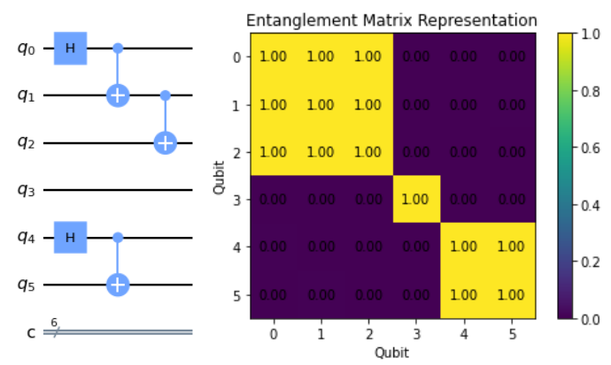
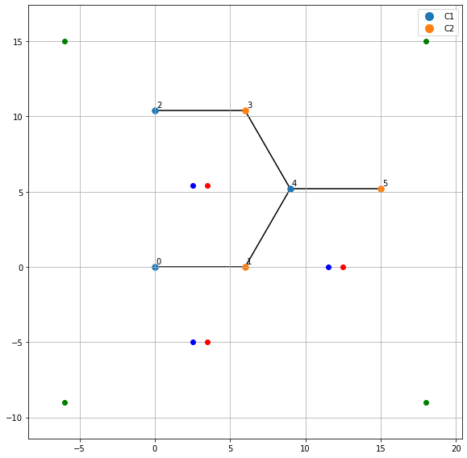
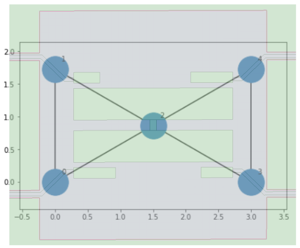
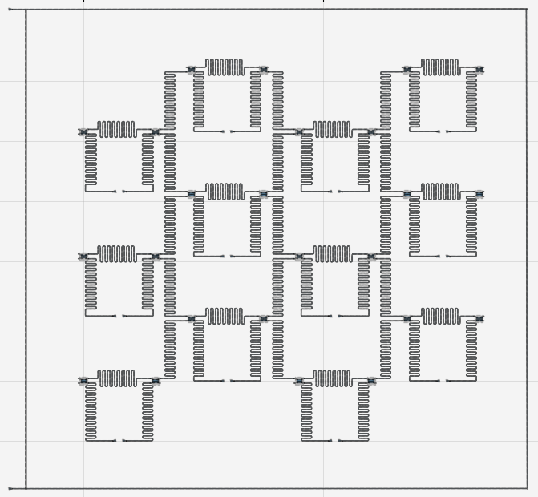
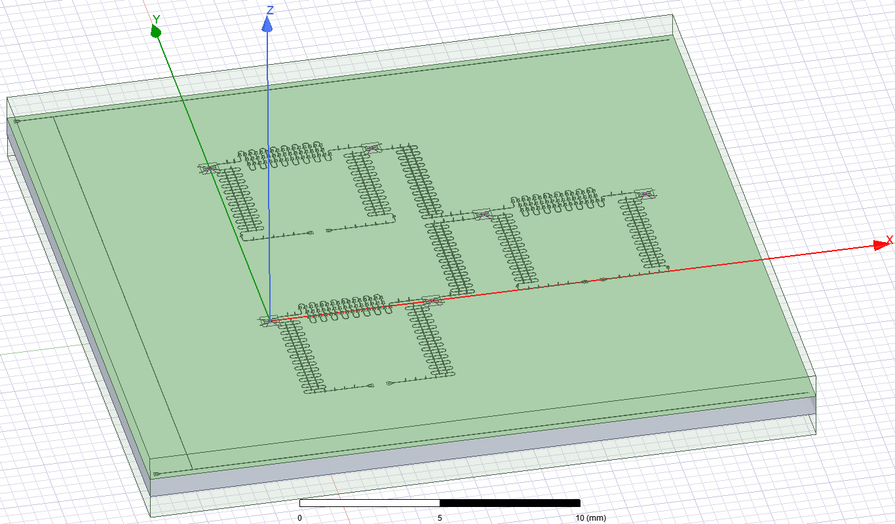

# QOSF Mentorship program - Circuit Optimization based on Entanglement and Quantum Chip Automatic Design

Here is the project that I developed during the QOSF Mentorship program cohort 7 - [QOSF](https://qosf.org/qc_mentorship/).  
In this work, we take into consideration the entanglement of the circuit to modify the connections of the qubits and improve the performance of the circuit as you can see in this [file](https://github.com/KevinJoven11/QOSF_METAL/blob/main/ent_matrix.ipynb) We implement an entanglement matrix on the quantum full adder circuit for two qubits to see how entangled are the qubits with others, and modify the architecture.  

The second work is to design a honey architecture lattice to implement a quantum chip using Qiskit Metal. The implementation takes the size of the lattice from x and y directions and packs the number of qubits allowed in the architecture. All the design is based on transmon like-qubits non tunable and each of them has its own control line. All the code from the creation of the lattice in [file](https://github.com/KevinJoven11/QOSF_METAL/blob/main/Lattice_Improve.ipynb), to the Qiskit metal and ansys implementation in [file](https://github.com/KevinJoven11/QOSF_METAL/blob/main/Metal_implementation.ipynb).  

Here are a couple of pictures if you want a test.

  

  
  

  

  

There are a considerable amount of improvements that I want to develop here, and eventually, it will come in the future!

